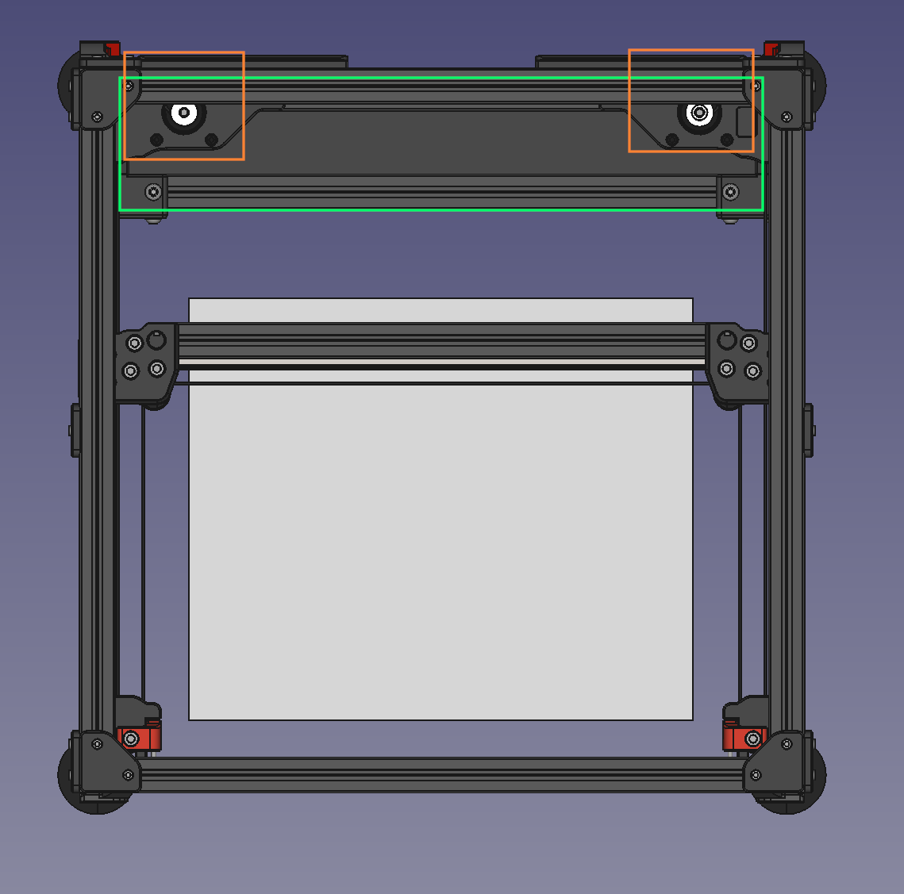
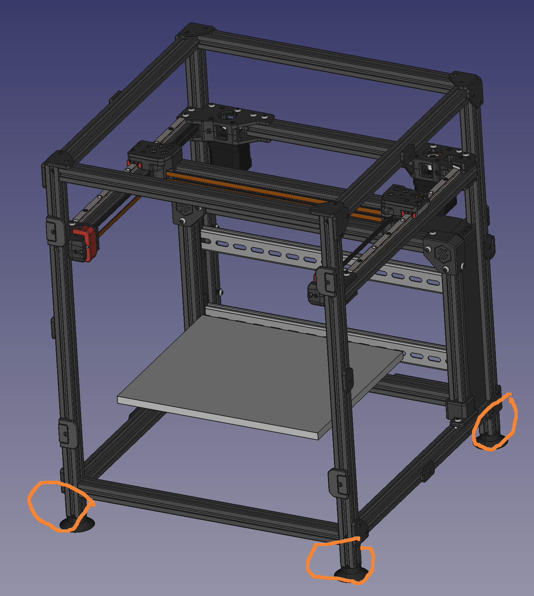
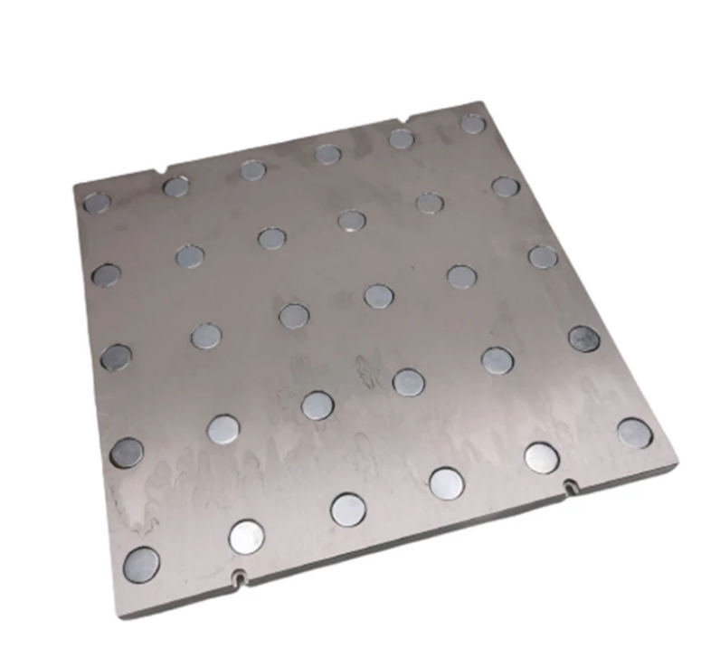
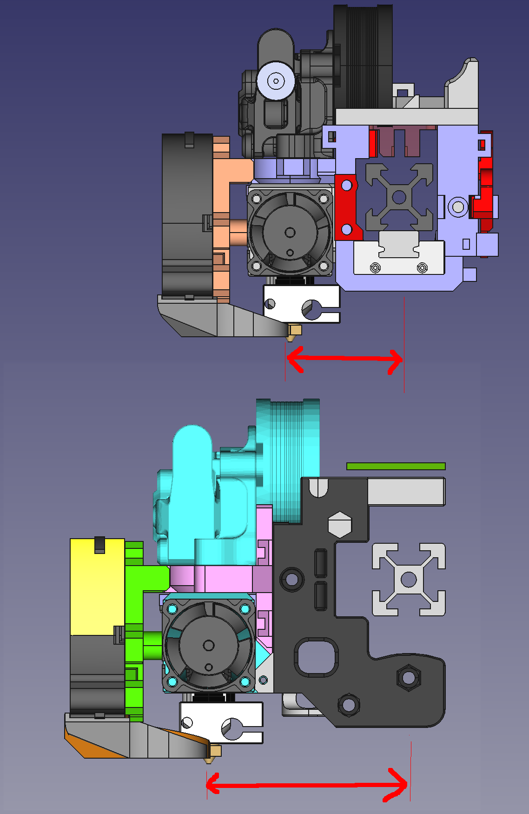
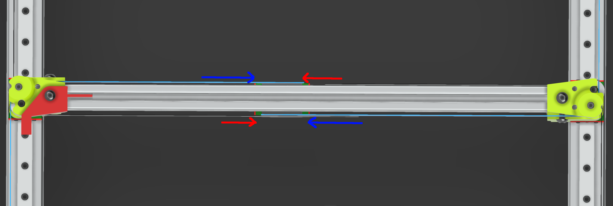
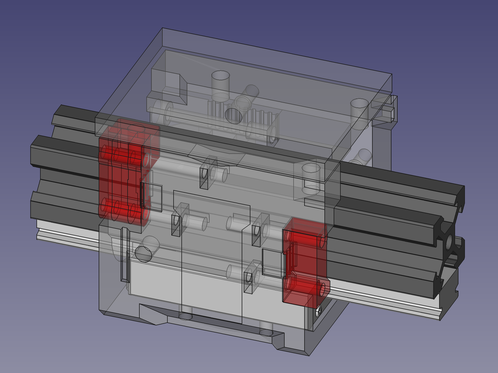
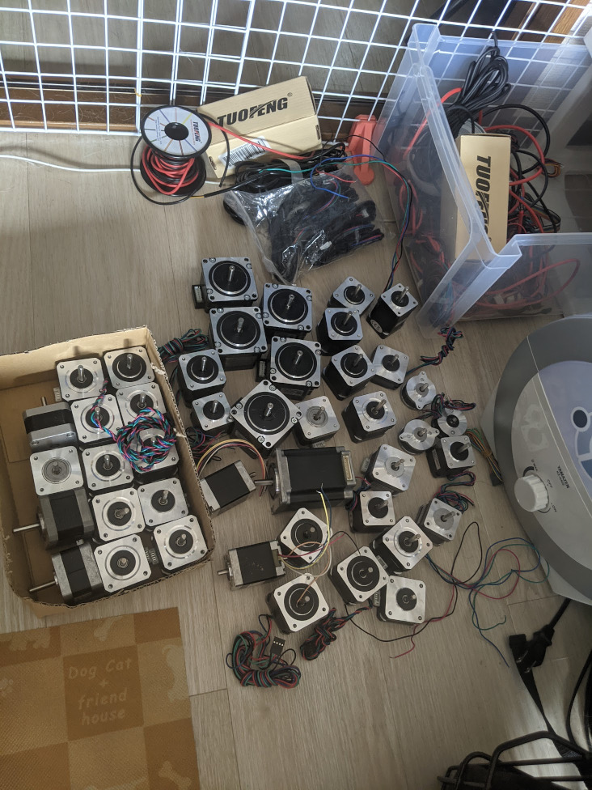

# Memo

## 1. フレームとベッド

- フレームは正四角形でベッドは長方形
  - AB モータはフレームのうち側に設計できる
  - 後ろスペースは配線や電気系部品設置スペースとして使える
  - AC/DC の電気部品を分けられる(下は AC 系、後ろのスペースは DC)
  - 3DP を逆さまにしなくても配線やメンテナンスでしる
- ベッドのサイズは定番のサイズがいいかもしれません
  - Pei シートなどのアクセサリが多い、調達しやすい
- アルミ板のベッドが欲しい(加工可能であればバグネットのスロットが欲しい)

図1. 例:Voron1.8フレーム

図2. 例:Voron1.8フレーム、なるべくマシンの中心を低くしたいので、足は要らないかも

図3. 例.アルミ板ベッドとマグネット

## 2. XY 軸

- X 軸のレールは下か上にマウントする
  - Extruder を X 軸の中心に近く設置するの方が安定
- ベルトをクロスパタン
  - ほかデザインに比べてベルトほ引っ張り力を均等に分散できる
- X キャリアをボックス形で
  - 裏面にカスタマイズ基板を付けられる
  - 表面にボルトのスロットを設計すれば、いろんな Extruder を対応できる
  - Extruder を変える場合、ベルトの再調整は不要
- 私がテストした nema17 モータの中 3ED の high torque が一番性能がいい(速度 500mm/s,加速 20000mm/s^2)

図4. 例.同じExttruderに上(Hevort)、下(Voron2)にマウントする場合のX軸中心からノズルまでの距離

図5. 例.CoreXYクロスベルト

図6. ボックス形例.Xキャリア

図7. 実機でテストしたモータの数

## 3. Z 軸

- 9mm か 12mm ベルトでベッドを上下制御と考える
  - 安い(ギアボックス付きの nema17 でもリニアステッピングより安い)
  - 台形ねじ品質の心配がない
  - 高速かつ静か

## 4. ソフトウェア

- FW の設定はカスタマイズ WebUI で行う
  - 手動設定ファイル編集による誤操作を減らす
  - プログラミング知識がない人も簡単に使える

例: Marlin の WebUI 設定+compiler システム : [EzFirmware](https://ezfirmware.th3dstudio.com/)

## 5. その他

- 3DP 独立した安全装置
  - マイコンやセンサー(温度、煙、火など)で３ DP の状態をモニタリングし、異常が発見した場合はアラームを鳴らせる、電源を切るなど
